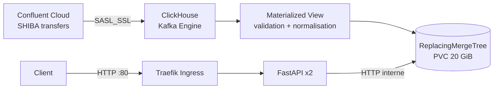

# SHIBA transfers — exercice Data Infra

Cette solution déploie dans une VM Linux Colima un cluster Kubernetes léger
(k3s via k3d), un ClickHouse persistant et une API FastAPI. Un tunnel Cloudflare
gratuit fournit l'URL publique. ClickHouse consomme directement Kafka avec son
moteur `Kafka`; une vue matérialisée normalise chaque message.

**URL de démonstration actuelle :**
[https://magic-knives-path-restrict.trycloudflare.com](https://magic-knives-path-restrict.trycloudflare.com)
([documentation OpenAPI](https://magic-knives-path-restrict.trycloudflare.com)).

Cette URL éphémère est aussi disponible avec `cat .runtime/public-url` et change
à chaque recréation du Quick Tunnel.


## Architecture



- **VM** : Linux sous Colima, 4 vCPU, 6 Go de RAM et disque de 30 Go.
- **Kubernetes** : k3s mono-nœud, choisi pour réduire la consommation mémoire
  et la complexité opérationnelle d'un test technique.
- **Ingestion** : table Kafka ClickHouse en `SASL_SSL/PLAIN`, groupe de
  consommateurs `bubblemaps-<nom>`, puis vue matérialisée.
- **Stockage** : partition mensuelle, tri par `(timestamp, unique_id)`,
  rétention d'un an et déduplication asynchrone sur cette clé complète.
- **API** : deux replicas sans état, utilisateur ClickHouse en lecture seule,
  probes Kubernetes et documentation OpenAPI.

## API

- `GET /transfers?limit=50` : derniers transferts.
- `GET /addresses/{address}/transfers` : activité entrante et sortante d'une
  adresse Ethereum.
- `GET /stats/overview?window_hours=24` : nombre de transferts, adresses
  uniques et volume.
- `GET /health/live` et `GET /health/ready`.
- `GET /docs` : Swagger UI.

Le flux fournit `amount` dans l'unité brute ERC-20, souvent en notation
scientifique (par exemple `8.59e25`). SHIBA utilise 18 décimales : l'API divise
donc par `10^18`. ClickHouse analyse directement le texte JSON en `Decimal256`
et l'API sérialise les décimaux comme chaînes.

## Déploiement

Prérequis locaux : Colima, k3d, `kubectl`, `kcat`, `cloudflared` et `tmux`. Les
secrets Kafka ne sont jamais ajoutés à Git.

Créer `api_key.txt` à la racine :

```text
API key:
<clé>

API secret:
<secret>
```

Découvrir le topic autorisé :

```bash
./scripts/discover_topics.sh
```

Créer la VM, déployer et ouvrir le tunnel public :

```bash
./scripts/deploy-colima.sh
```

Le script affiche les URL finales :

```text
API:  https://<sous-domaine>.trycloudflare.com
Docs: https://<sous-domaine>.trycloudflare.com/docs
```

Il construit l'image sur la VM, l'importe dans containerd, crée les Secrets
Kubernetes, initialise ClickHouse puis attend que les déploiements soient prêts.
Il est réexécutable et conserve les mots de passe ClickHouse existants. Le Mac
doit rester allumé et le Quick Tunnel doit tourner pendant la démonstration.
Le tunnel reste actif dans `tmux`; `./scripts/start-tunnel.sh` le recrée si
nécessaire.

## Vérification et visite guidée

```bash
PUBLIC_URL="$(cat .runtime/public-url)"
curl "$PUBLIC_URL/health/ready"
curl "$PUBLIC_URL/transfers?limit=5"
curl "$PUBLIC_URL/stats/overview?window_hours=24"

colima ssh --profile bubblemaps
docker ps
exit
kubectl --context k3d-bubblemaps -n bubblemaps get pods,pvc,ingress
kubectl --context k3d-bubblemaps -n bubblemaps logs statefulset/clickhouse
kubectl --context k3d-bubblemaps -n bubblemaps exec statefulset/clickhouse -- \
  sh -lc 'clickhouse-client --password "$CLICKHOUSE_PASSWORD" --query \
  "SELECT count(), min(timestamp), max(timestamp) FROM bubblemaps.transfers"'
```

Pour observer l'ingestion :

```bash
kubectl --context k3d-bubblemaps -n bubblemaps exec statefulset/clickhouse -- \
  sh -lc 'clickhouse-client --password "$CLICKHOUSE_PASSWORD" --query \
  "SELECT database, table, is_currently_used, exceptions.text
   FROM system.kafka_consumers FORMAT Vertical"'
```

## Développement local

```bash
python3.12 -m venv .venv
source .venv/bin/activate
pip install -e ".[dev]"
pytest
ruff check .
```
