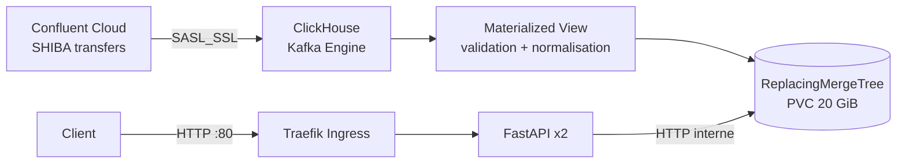

# SHIBA transfers — exercice Data Infra

Cette solution déploie dans une VM Linux Colima un cluster Kubernetes léger
(k3s via k3d), un ClickHouse persistant et une API FastAPI. Un tunnel Cloudflare
gratuit fournit l'URL publique. ClickHouse consomme directement Kafka avec son
moteur `Kafka`; une vue matérialisée normalise chaque message.

**URL de démonstration actuelle :**
[https://rome-symbols-bee-reid.trycloudflare.com](https://rome-symbols-bee-reid.trycloudflare.com)
([documentation OpenAPI](https://rome-symbols-bee-reid.trycloudflare.com/docs)).

Le déroulé complet de la visite est disponible dans
[`GUIDE_ENTRETIEN.md`](GUIDE_ENTRETIEN.md).

## Architecture



- **VM** : Linux sous Colima, 4 vCPU, 6 Go de RAM et disque de 30 Go.
- **Kubernetes** : k3s mono-nœud, choisi pour réduire la consommation mémoire
  et la complexité opérationnelle d'un test technique.
- **Ingestion** : table Kafka ClickHouse en `SASL_SSL/PLAIN`, groupe de
  consommateurs `bubblemaps-<nom>`, puis vue matérialisée.
- **Stockage** : partition mensuelle, tri par timestamp/identifiant, rétention
  d'un an et déduplication asynchrone par `ReplacingMergeTree`.
- **API** : deux replicas sans état, utilisateur ClickHouse en lecture seule,
  probes Kubernetes et documentation OpenAPI.

## API

- `GET /transfers?limit=50` : derniers transferts.
- `GET /addresses/{address}/transfers` : activité entrante et sortante d'une
  adresse Ethereum.
- `GET /stats/overview?window_hours=24` : nombre de transferts, adresses
  uniques et volume.
- `GET /health/live` et `GET /health/ready`.
- `GET /docs` : Swagger UI.

Les montants JSON sont sérialisés comme chaînes pour ne pas perdre de précision.
SHIBA utilise 18 décimales.

## Déploiement

Prérequis locaux : Colima, k3d, `kubectl`, `kcat`, `cloudflared` et `tmux`. Les
secrets Kafka ne sont jamais ajoutés à Git.

Créer `api_key.txt` à la racine :

```text
API key:
<clé>

API secret:
<secret>
```

Découvrir le topic autorisé :

```bash
./scripts/discover_topics.sh
```

Créer la VM, déployer et ouvrir le tunnel public :

```bash
./scripts/deploy-colima.sh
```

Le script affiche les URL finales :

```text
API:  https://<sous-domaine>.trycloudflare.com
Docs: https://<sous-domaine>.trycloudflare.com/docs
```

Il construit l'image sur la VM, l'importe dans containerd, crée les Secrets
Kubernetes, initialise ClickHouse puis attend que les déploiements soient prêts.
Il est réexécutable et conserve les mots de passe ClickHouse existants. Le Mac
doit rester allumé et le Quick Tunnel doit tourner pendant la démonstration.
Le tunnel reste actif dans `tmux`; `./scripts/start-tunnel.sh` le recrée si
nécessaire.

## Vérification et visite guidée

```bash
PUBLIC_URL="$(cat .runtime/public-url)"
curl "$PUBLIC_URL/health/ready"
curl "$PUBLIC_URL/transfers?limit=5"
curl "$PUBLIC_URL/stats/overview?window_hours=24"

colima ssh --profile bubblemaps
docker ps
exit
kubectl --context k3d-bubblemaps -n bubblemaps get pods,pvc,ingress
kubectl --context k3d-bubblemaps -n bubblemaps logs statefulset/clickhouse
kubectl --context k3d-bubblemaps -n bubblemaps exec statefulset/clickhouse -- \
  clickhouse-client --query \
  "SELECT count(), min(timestamp), max(timestamp) FROM bubblemaps.transfers"
```

Pour observer l'ingestion :

```bash
kubectl --context k3d-bubblemaps -n bubblemaps exec statefulset/clickhouse -- \
  clickhouse-client --query \
  "SELECT database, table, is_currently_used, last_exception
   FROM system.kafka_consumers FORMAT Vertical"
```

## Développement local

```bash
python3.12 -m venv .venv
source .venv/bin/activate
pip install -e ".[dev]"
pytest
ruff check .
```

## Limites et passage à l'échelle

- Le cluster et ClickHouse n'ont qu'un nœud : la panne de la VM interrompt
  l'API et l'ingestion. En production, utiliser plusieurs nœuds Kubernetes,
  ClickHouse Keeper, des tables répliquées et un stockage sauvegardé.
- Un seul consommateur Kafka est configuré. On peut augmenter
  `kafka_num_consumers` jusqu'au nombre de partitions, puis répartir ClickHouse
  sur plusieurs shards.
- `ReplacingMergeTree` ne garantit pas une déduplication immédiate. Les requêtes
  n'utilisent volontairement pas `FINAL`, coûteux à grande échelle. Une table
  agrégée ou un identifiant d'événement idempotent serait préférable si une
  exactitude instantanée est requise.
- Les statistiques lisent les partitions brutes. Des vues matérialisées
  `AggregatingMergeTree` deviennent nécessaires quand le volume augmente.
- L'exposition est en HTTP pour garder le test reproductible sans domaine.
  En production : DNS, cert-manager/TLS, authentification API, rate limiting,
  NetworkPolicies, External Secrets/Vault et restriction SSH par CIDR.
- Le parseur tolère plusieurs noms de champs usuels. Une fois le contrat Kafka
  confirmé, il faut figer un schéma (Avro/Protobuf + Schema Registry) et envoyer
  les messages invalides vers une dead-letter queue.
- Le champ source `amount` est un nombre JSON à virgule flottante. Une chaîne
  décimale ou un entier éviterait la perte de précision avant l'ingestion.
